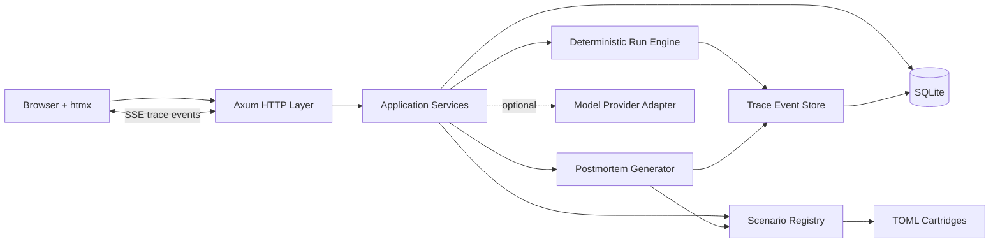
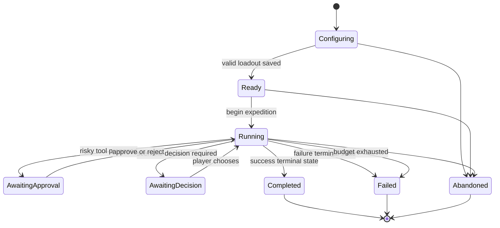

# Tracebound: The Harness Below

## Product Requirements Document

| Field | Value |
|---|---|
| Product | Tracebound: The Harness Below |
| Product type | Self-contained educational roguelike web application |
| Primary audience | Software engineers, architects, technical leads, and engineering managers |
| Primary purpose | Teach AI-native software development and AI harness design through interactive play |
| MVP platform | Local web application distributed as a single executable |
| MVP stack | Rust, Axum, Askama, htmx, Server-Sent Events, SQLite, TOML |
| Document status | Build-ready MVP specification |

## 1. Executive Summary

Tracebound is a short-session roguelike RPG in which the player does not directly control a hero. The player configures and supervises an AI engineering harness attempting simulated software delivery missions.

Each expedition presents an ambiguous engineering objective. The player selects context, tools, instructions, autonomy limits, approval policies, and evaluators. A deterministic agent simulation then attempts the mission. The player studies its execution trace, intervenes when necessary, and receives a postmortem explaining why the harness succeeded or failed.

The game teaches AI-native engineering by making its concepts into game mechanics:

- Context documents become inventory.
- Tools and APIs become abilities.
- Token, latency, and cost limits become resource budgets.
- Approval gates become wards.
- Agent execution becomes an expedition trace.
- Evaluators become victory conditions.
- Prompt injection, stale context, over-broad tools, and premature completion become traps.
- Checkpoints and durable memory become campfires.

The MVP must be deterministic, local-first, safe, easy to run, and useful without an external model or API key. Optional model integrations may later provide narration and coaching, but they must not control scenario truth or grading.

## 2. Problem Statement

Traditional engineering documentation has low voluntary engagement. New AI-native practices are especially difficult to communicate because many important concepts are experiential:

- A prompt that appears reasonable can still produce poor behavior.
- More context can reduce performance rather than improve it.
- Tool design and permissions shape agent behavior.
- Agent outputs cannot be trusted without objective evaluation.
- Execution traces often reveal failures that final answers conceal.
- Multi-agent systems add coordination costs as well as capability.
- Autonomy must be earned through observability, constraints, and recovery mechanisms.

A static document can describe these ideas, but it does not let engineers feel their consequences. Tracebound should create a safe environment where players can make harness-design decisions, observe failure, retry quickly, and compare strategies with teammates.

## 3. Product Vision

Create a replayable learning game that makes AI-native software engineering concrete, discussable, and socially shareable.

A successful player should leave with the intuition that AI-native development is not primarily prompt writing. It is the discipline of building environments in which imperfect intelligence can make progress safely, leave evidence, recover from mistakes, and be judged against reality.

## 4. Product Goals

### 4.1 Primary goals

1. Teach six foundational AI-native engineering concepts through mechanics rather than quizzes.
2. Support a complete learning session in 15 to 25 minutes.
3. Run locally with minimal setup and no required external services.
4. Make failed runs educational and worth discussing.
5. Produce a compact postmortem that players can share with a team.
6. Establish a cartridge-based scenario format that can later support internally authored adventures.
7. Keep the codebase small enough for a single team or motivated maintainer to understand.

### 4.2 Success criteria

The MVP is successful when:

- A new user can download or build the application, launch it, and begin a run without configuring a database or model provider.
- A player can complete all six MVP encounters.
- Each encounter demonstrates a distinct AI-native concept through gameplay.
- Replaying an encounter with a different harness configuration can produce a meaningfully different outcome.
- Every run produces a deterministic, inspectable trace and postmortem.
- Scenario content can be changed without recompiling core engine logic during development.
- At least one complete scenario is authored entirely through the cartridge format without custom Rust code.

## 5. Non-Goals for MVP

The MVP will not include:

- Real access to the player’s filesystem, shell, source repositories, cloud accounts, or company systems.
- Autonomous modification of production resources.
- User accounts or authentication.
- A hosted multi-tenant service.
- A global leaderboard.
- Real-time multiplayer.
- Fully generated scenarios.
- Arbitrary third-party plugins.
- A general-purpose agent framework.
- A visual scenario editor.
- Required use of an LLM.
- Mobile-first layouts.
- Complex combat, equipment rarity, crafting, or economy systems unrelated to learning goals.

## 6. Design Principles

### 6.1 The mechanic is the lesson

Do not disguise documentation as fantasy flavor. Player decisions must produce consequences that reflect real harness-design tradeoffs.

### 6.2 Deterministic truth, variable presentation

Scenario state, tool behavior, and grading must be deterministic in the MVP. Optional AI-generated narration may vary, but it cannot alter facts, available actions, or scores.

### 6.3 Failure should reveal structure

A failed run must identify the decision, missing control, or misleading evidence that caused the failure. The game should reward understanding, not lucky completion.

### 6.4 Start simple, earn autonomy

The campaign should demonstrate that deterministic workflows are often preferable to unconstrained agents. Additional autonomy should provide benefits only when paired with appropriate controls.

### 6.5 Local-first and inspectable

The product should work offline after installation. Game state, traces, scenarios, and configuration should be readable and exportable.

### 6.6 Short sessions, dense consequences

Each encounter should contain a small number of meaningful decisions. Avoid filler rooms and repetitive clicking.

### 6.7 Retro atmosphere, modern usability

The visual identity may evoke DOS, Amiga, dungeon terminals, and science fantasy. Text readability, keyboard navigation, and trace comprehension take priority over ornament.

## 7. Target Users

### 7.1 Primary persona: Software Engineer

Needs practical intuition for using agents safely in daily development. Prefers learning through systems and examples rather than policy documents.

### 7.2 Primary persona: Technical Lead or Architect

Needs a shared vocabulary for discussing context, tools, autonomy, observability, and evaluation with a team.

### 7.3 Secondary persona: Engineering Manager

Needs to understand why effective AI adoption requires investment in harnesses, documentation, tests, and operating controls.

### 7.4 Secondary persona: Scenario Author

Wants to turn an internal engineering lesson, incident, or architectural tradeoff into a reusable learning encounter without changing engine code.

## 8. Learning Objectives

After completing the MVP campaign, a player should be able to explain and apply the following concepts:

1. **Define success explicitly**  
   Convert an ambiguous request into observable acceptance criteria.

2. **Select context deliberately**  
   Prefer relevant, trustworthy context over indiscriminate context volume.

3. **Design narrow, legible tools**  
   Recognize that tool contracts and permissions influence agent reliability.

4. **Constrain autonomy according to risk**  
   Use approvals, policy checks, and environment boundaries appropriately.

5. **Inspect traces rather than trusting summaries**  
   Evaluate how an agent reached a result, not only what it claimed.

6. **Use objective evaluations**  
   Judge the actual environment state with repeatable graders.

7. **Preserve durable progress**  
   Use checkpoints, summaries, and artifacts to support long-running work.

8. **Add agents only when specialization earns its cost**  
   Understand routing, handoffs, and coordination overhead.

## 9. Core Gameplay

### 9.1 Session structure

A complete session consists of one or more encounters. Each encounter follows this loop:

1. Read the quest briefing.
2. Review the initial objective and constraints.
3. Assemble the harness loadout.
4. Begin the expedition.
5. Observe trace events.
6. Respond to intervention points.
7. Reach a terminal scenario state.
8. Review score, graders, and postmortem.
9. Unlock a codex entry or next encounter.
10. Optionally replay with a different harness.

### 9.2 Player-controlled harness configuration

The player may configure some or all of the following, depending on the encounter:

- Agent instruction set
- Context documents
- Tool availability
- Tool permission levels
- Autonomy level
- Approval policy
- Budget allocation
- Evaluator selection
- Checkpoint policy
- Delegation or routing strategy

Each encounter should restrict the available options so the decision space remains understandable.

### 9.3 Expedition execution

The deterministic simulation processes the selected harness against scenario rules. It emits trace events and may pause at intervention points.

Examples of intervention points:

- Approve or reject a high-risk tool call.
- Add missing acceptance criteria.
- Remove a stale context item.
- Require a regression test before completion.
- Stop an agent that is looping.
- Route work to a specialist.
- Restore from a checkpoint.

### 9.4 Terminal outcomes

An encounter may end in:

- Complete success
- Qualified success
- Safe failure
- Unsafe failure
- Budget exhaustion
- Premature completion
- Unrecoverable state corruption

The final outcome is determined by scenario state and graders, not by agent narration.

## 10. Game Systems

### 10.1 Context inventory

Context items represent documents, logs, source files, messages, diagrams, or policies.

Each context item contains:

- Identifier
- Display title
- Description
- Token or capacity cost
- Trust level
- Freshness metadata
- Tags
- Hidden effects
- Optional contradictions with other items

Possible effects include:

- Enabling a correct action
- Increasing confidence in an incorrect action
- Revealing a hidden state
- Consuming budget without helping
- Triggering a prompt-injection trap
- Satisfying a policy requirement

The player has a limited context capacity. Loading all available context should rarely be optimal.

### 10.2 Tools

Tools represent actions the simulated agent can take.

Each tool contains:

- Identifier
- Display name
- Purpose
- Input schema
- Permission level
- Risk classification
- Cost
- Preconditions
- Deterministic result rules
- Possible side effects
- Approval requirement

Risk classifications:

- Low
- Moderate
- High
- Critical

Example tools:

- Search logs
- Read repository file
- Query staging database
- Apply patch
- Run tests
- Deploy to staging
- Modify production inventory

Broad tools should offer flexibility but increase failure risk. Narrow tools should constrain behavior and improve trace clarity.

### 10.3 Instructions

Instruction sets define the simulated agent’s behavior priorities.

Examples:

- Move quickly and minimize tool calls.
- Verify assumptions before modifying state.
- Prefer reversible actions.
- Stop and request approval for high-risk changes.
- Do not claim completion until all selected graders pass.

Instructions may conflict. Scenarios can test whether the player provides clear priority ordering.

### 10.4 Autonomy levels

The MVP supports three autonomy levels:

1. **Workflow**  
   Fixed action sequence with limited branching.

2. **Guided agent**  
   The simulation selects among allowed actions but pauses at defined checkpoints.

3. **Autonomous agent**  
   The simulation selects actions until it completes, hits a policy gate, exhausts its budget, or enters a terminal state.

Not every encounter exposes every autonomy level.

### 10.5 Approval policies

Approval policies determine whether risky tool calls require player confirmation.

MVP policies:

- Approve all state changes.
- Approve high-risk and critical actions.
- Approve critical actions only.
- No approvals.

The UI must clearly show the proposed action, risk, inputs, expected side effects, and alternatives before the player decides.

### 10.6 Budgets

The MVP uses one combined expedition budget called **Focus**. It abstracts token usage, latency, and monetary cost.

Actions consume Focus. Context selection reserves Focus at the beginning of a run. A scenario may apply penalties for:

- Repeated retrieval
- Tool-call loops
- Overly broad searches
- Failed retries
- Unnecessary delegation

The combined budget keeps the first release understandable. Later versions may separate tokens, time, and cost.

### 10.7 Trace

The trace is the central interface during execution.

Trace event types:

- Run started
- Context loaded
- Plan formed
- Tool proposed
- Approval requested
- Approval granted
- Approval denied
- Tool executed
- Tool failed
- State changed
- Evaluator executed
- Checkpoint created
- Checkpoint restored
- Agent delegated
- Warning raised
- Budget changed
- Agent claimed completion
- Run ended

Each trace event contains:

- Sequence number
- Timestamp relative to run start
- Actor
- Event type
- Human-readable summary
- Structured payload
- Focus cost
- Risk level
- Related scenario state keys

The UI must allow players to expand structured details without leaving the run screen.

### 10.8 Graders

Graders evaluate actual scenario state, trace behavior, or resource usage.

MVP grader types:

- State assertion
- Forbidden state assertion
- Required action observed
- Forbidden action observed
- Required test passed
- Budget threshold
- Approval policy compliance
- Completion claim validity

Each grader has:

- Identifier
- Description
- Weight
- Pass condition
- Failure explanation
- Optional hidden status during play

Some graders may remain sealed until the run ends to prevent the encounter from becoming a checklist puzzle.

### 10.9 Scoring

The score is calculated from weighted graders and modifiers.

Suggested score categories:

- Objective completion: 50 points
- Safety and policy compliance: 20 points
- Evaluation quality: 15 points
- Trace quality and recoverability: 10 points
- Resource efficiency: 5 points

A run that violates a critical safety constraint cannot receive a passing grade, regardless of raw score.

Do not award points solely for speed.

### 10.10 Postmortem

Every completed run produces a postmortem containing:

- Outcome
- Total score
- Grader results
- Critical decision
- First warning sign
- Harmful or irrelevant context
- Most useful tool decision
- Missed safeguard
- Suggested alternative harness
- One concise learning principle
- Newly unlocked codex entry

The postmortem must be derived from deterministic scenario metadata and trace analysis.

### 10.11 Codex

The codex stores short learning entries unlocked through play.

Each entry contains:

- Title
- Concept summary
- Why it matters
- Example from the completed encounter
- Practical engineering checklist
- Optional internal documentation link configured by the scenario author

Codex entries should take less than three minutes to read.

### 10.12 Shareable expedition report

The player can copy or export a compact Markdown report:

```text
Expedition: The Phantom Inventory
Outcome: Passed with reservations
Critical intervention: Rejected production mutation
Context discarded: Legacy runbook
Eval added: Concurrent reservation regression
Largest cost: Repository-wide retrieval
Lesson: Narrow tools beat broad permissions
```

The report must not contain hidden scenario data or sensitive trace payloads.

## 11. MVP Campaign

The MVP campaign contains six encounters. Encounters unlock sequentially, but previously completed encounters remain replayable.

### 11.1 Encounter 1: The Mines of Ambiguity

**Primary concept:** Define success explicitly.

**Scenario:** The player is asked to improve checkout performance without changing customer behavior.

**Core decisions:**

- Select measurable acceptance criteria.
- Identify conflicting requirements.
- Choose whether to begin execution with an incomplete objective.

**Failure modes:**

- Optimizing the wrong metric.
- Declaring success without a baseline.
- Changing customer behavior while improving latency.

**Required lesson:** An agent cannot compensate for an undefined outcome.

### 11.2 Encounter 2: The Context Vault

**Primary concept:** Select context deliberately.

**Scenario:** The agent must diagnose a recurring service failure using logs, architecture documents, incident notes, and an obsolete runbook.

**Core decisions:**

- Choose context within a capacity limit.
- Identify stale or untrusted material.
- Remove context after observing misleading behavior.

**Failure modes:**

- Loading every document.
- Trusting an obsolete runbook.
- Missing the one recent deployment note that explains the defect.

**Required lesson:** Context quality and relevance matter more than context volume.

### 11.3 Encounter 3: The Toolsmith’s Forge

**Primary concept:** Design narrow, legible tools.

**Scenario:** The player must equip an agent to repair a repository while choosing among broad and narrow tool contracts.

**Core decisions:**

- Choose between an unrestricted shell and purpose-built repository tools.
- Configure tool permissions.
- Decide which mutations require approval.

**Failure modes:**

- Using a broad tool that modifies unintended files.
- Providing ambiguous tool inputs.
- Granting production-level permissions for a staging task.

**Required lesson:** Tool design is part of the reasoning environment.

### 11.4 Encounter 4: The Hall of Mirrors

**Primary concept:** Inspect traces and use objective evaluations.

**Scenario:** Two apparent solutions produce similar final answers, but only one is grounded in validated state.

**Core decisions:**

- Inspect trace evidence.
- Choose graders.
- Reject unsupported completion claims.

**Failure modes:**

- Trusting a persuasive summary.
- Evaluating prose instead of environment state.
- Omitting a regression test.

**Required lesson:** Final answers can look correct while the underlying task remains incomplete.

### 11.5 Encounter 5: The Memory Marsh

**Primary concept:** Preserve durable progress.

**Scenario:** A multi-stage migration spans several context windows and simulated work sessions.

**Core decisions:**

- Create checkpoints.
- Write a durable progress summary.
- Restore after a failed continuation.

**Failure modes:**

- Repeating completed work.
- Losing unresolved risks.
- Resuming from an invalid state.

**Required lesson:** Long-running work requires explicit state and handoff artifacts.

### 11.6 Encounter 6: The Guild of Too Many Agents

**Primary concept:** Add agents only when specialization earns its cost.

**Scenario:** The player may solve a system change with one general agent, a deterministic workflow, or a group of specialists.

**Core decisions:**

- Select an orchestration strategy.
- Define routing and handoff boundaries.
- Control coordination cost.

**Failure modes:**

- Circular delegation.
- Conflicting specialist recommendations.
- Excessive Focus consumption.
- Missing ownership at handoff boundaries.

**Required lesson:** Multi-agent designs are useful only when specialization outweighs coordination overhead.

## 12. User Experience Requirements

### 12.1 Primary screens

1. **Title screen**
   - Continue campaign
   - New campaign
   - Encounter select
   - Codex
   - Settings

2. **Quest briefing**
   - Narrative introduction
   - Objective
   - Known constraints
   - Available rewards
   - Begin loadout

3. **Harness loadout**
   - Instructions
   - Context inventory
   - Tools and permissions
   - Autonomy level
   - Approval policy
   - Evaluators
   - Focus budget summary

4. **Expedition screen**
   - Scenario viewport
   - Trace panel
   - Current Focus
   - Harness summary
   - Active graders, when visible
   - Intervention controls

5. **Postmortem screen**
   - Outcome and score
   - Timeline of critical events
   - Grader breakdown
   - Learning principle
   - Suggested alternative
   - Retry and continue controls
   - Copy report

6. **Codex screen**
   - Unlocked entries
   - Concept filtering
   - Internal documentation links

### 12.2 Interaction model

- Use standard server-rendered HTML.
- Use htmx for fragment updates and form submissions.
- Use Server-Sent Events for trace streaming.
- The application must remain usable if JavaScript beyond htmx is minimal.
- Critical actions require explicit buttons and cannot rely on drag-only interactions.

### 12.3 Visual direction

- Late-DOS or Amiga-inspired science-fantasy interface
- High-contrast panels
- Pixel or bitmap-inspired decorative elements
- Warm parchment, burgundy, antique gold, dark wood, and terminal-green accents are acceptable
- Monospaced type for traces
- Highly readable body type for instructions and postmortems
- Subtle animation only
- Sound disabled by default

### 12.4 Accessibility

The MVP must include:

- Full keyboard navigation
- Visible focus indicators
- Semantic headings and landmarks
- Text labels for all icons
- Sufficient color contrast
- No information conveyed by color alone
- Reduced-motion support
- Screen-reader-readable trace updates
- Configurable text scale using browser controls without layout breakage

## 13. Technical Architecture

### 13.1 Chosen stack

- Rust stable toolchain
- Axum for HTTP routing
- Tokio for asynchronous runtime
- Askama for server-side templates
- htmx for HTML fragment interactions
- Server-Sent Events for trace delivery
- SQLite for campaign and run persistence
- SQLx for database access and migrations
- Serde for serialization
- TOML for scenario cartridges
- rust-embed for static assets and bundled scenarios
- tracing and tracing-subscriber for application logs

### 13.2 Deployment model

The application is distributed as one executable.

On startup it must:

1. Determine an application data directory.
2. Create or open the SQLite database.
3. Run embedded database migrations.
4. Load and validate bundled scenario cartridges.
5. Bind to `127.0.0.1` on an available configured port.
6. Print the local URL.
7. Optionally open the default browser.

Default bind address must not expose the application to the local network.

### 13.3 High-level component model



### 13.4 Architectural boundaries

#### Web layer

Responsibilities:

- Parse requests
- Validate form input
- Call application services
- Render full pages or fragments
- Manage SSE connections

The web layer must not contain scenario-specific rules.

#### Application services

Responsibilities:

- Create campaigns and runs
- Apply player decisions
- Coordinate engine execution
- Persist state
- Generate reports
- Enforce progression rules

#### Deterministic engine

Responsibilities:

- Evaluate scenario conditions
- Select simulated agent actions
- Execute deterministic tool rules
- Emit trace events
- Pause at intervention points
- Run graders
- Produce terminal outcomes

The engine must not depend on HTTP, HTML, SQLite, or an external model provider.

#### Scenario registry

Responsibilities:

- Load embedded and development cartridges
- Validate schemas
- Resolve scenario identifiers
- Expose immutable scenario definitions

#### Persistence layer

Responsibilities:

- Campaign progress
- Run state
- Player decisions
- Trace events
- Scores
- Codex unlocks
- Settings

#### Optional narrator adapter

Responsibilities:

- Generate flavor text or coaching from an allowlisted subset of run data
- Support provider-disabled behavior
- Never mutate run state
- Never determine grades

## 14. Suggested Repository Structure

```text
tracebound/
├── Cargo.toml
├── README.md
├── LICENSE
├── crates/
│   ├── tracebound-domain/
│   │   ├── src/
│   │   │   ├── scenario.rs
│   │   │   ├── run.rs
│   │   │   ├── trace.rs
│   │   │   ├── grader.rs
│   │   │   └── lib.rs
│   ├── tracebound-engine/
│   │   ├── src/
│   │   │   ├── engine.rs
│   │   │   ├── rules.rs
│   │   │   ├── tools.rs
│   │   │   ├── postmortem.rs
│   │   │   └── lib.rs
│   ├── tracebound-store/
│   │   ├── migrations/
│   │   └── src/
│   │       ├── sqlite.rs
│   │       └── lib.rs
│   └── tracebound-web/
│       ├── src/
│       │   ├── routes/
│       │   ├── templates/
│       │   ├── sse.rs
│       │   ├── app_state.rs
│       │   └── main.rs
│       ├── templates/
│       └── static/
├── scenarios/
│   ├── 01-mines-of-ambiguity/
│   ├── 02-context-vault/
│   ├── 03-toolsmiths-forge/
│   ├── 04-hall-of-mirrors/
│   ├── 05-memory-marsh/
│   └── 06-guild-of-too-many-agents/
├── tests/
│   ├── scenario_validation.rs
│   ├── deterministic_runs.rs
│   └── web_smoke.rs
└── docs/
    ├── scenario-authoring.md
    └── architecture.md
```

A workspace is recommended, but the first implementation may begin as a single crate if that materially accelerates delivery. Preserve the architectural boundaries even if they initially share one package.

## 15. Domain Model

### 15.1 Core identifiers

Use strongly typed identifier wrappers rather than raw strings where practical:

- `ScenarioId`
- `EncounterId`
- `CampaignId`
- `RunId`
- `ContextId`
- `ToolId`
- `GraderId`
- `TraceEventId`

### 15.2 Run status

```rust
pub enum RunStatus {
    Configuring,
    Ready,
    Running,
    AwaitingApproval,
    AwaitingDecision,
    Completed,
    Failed,
    Abandoned,
}
```

### 15.3 Risk level

```rust
pub enum RiskLevel {
    Low,
    Moderate,
    High,
    Critical,
}
```

### 15.4 Autonomy level

```rust
pub enum AutonomyLevel {
    Workflow,
    Guided,
    Autonomous,
}
```

### 15.5 Trace event

```rust
pub struct TraceEvent {
    pub id: TraceEventId,
    pub run_id: RunId,
    pub sequence: u64,
    pub elapsed_ms: u64,
    pub actor: String,
    pub kind: TraceEventKind,
    pub summary: String,
    pub payload: serde_json::Value,
    pub focus_delta: i32,
    pub risk: Option<RiskLevel>,
    pub related_state_keys: Vec<String>,
}
```

### 15.6 Run state

```rust
pub struct RunState {
    pub id: RunId,
    pub scenario_id: ScenarioId,
    pub status: RunStatus,
    pub focus_remaining: i32,
    pub selected_context: Vec<ContextId>,
    pub selected_tools: Vec<ToolId>,
    pub autonomy: AutonomyLevel,
    pub approval_policy: ApprovalPolicy,
    pub selected_graders: Vec<GraderId>,
    pub world_state: serde_json::Map<String, serde_json::Value>,
    pub pending_intervention: Option<PendingIntervention>,
    pub outcome: Option<RunOutcome>,
}
```

## 16. Run State Machine



Every state transition must be validated by the application service. Invalid transitions return a domain error and do not modify persisted state.

## 17. Scenario Cartridge Format

### 17.1 Cartridge goals

Scenario cartridges must:

- Be human-readable.
- Be validated at startup.
- Define scenario content without Rust code.
- Support deterministic branching.
- Support hidden state and grader definitions.
- Permit internal documentation links.
- Avoid arbitrary code execution.

### 17.2 Cartridge layout

Each scenario directory may contain:

```text
scenario-directory/
├── scenario.toml
├── briefing.md
├── codex.md
└── assets/
    ├── portrait.png
    └── map.png
```

### 17.3 Illustrative TOML schema

```toml
schema_version = 1
id = "phantom-inventory"
title = "The Phantom Inventory"
sequence = 4
difficulty = 2
focus_budget = 20

concepts = [
  "context-selection",
  "tool-permissions",
  "regression-evals"
]

[briefing]
summary = "Customers can order inventory that is not actually available."
objective = "Identify and repair the overselling defect."

[initial_state]
race_condition_reproduced = false
race_condition_fixed = false
regression_test_added = false
production_mutated = false

[[context]]
id = "old-runbook"
title = "Inventory Recovery Runbook"
description = "A detailed but obsolete operational procedure."
cost = 3
trust = "low"
freshness = "stale"
tags = ["obsolete", "operations"]
effects = ["bias_toward_production_mutation"]

[[context]]
id = "deployment-diff"
title = "Recent Reservation Service Diff"
description = "The deployment that introduced concurrent reservation handling."
cost = 2
trust = "high"
freshness = "current"
tags = ["source", "deployment"]
effects = ["reveal_race_condition"]

[[tools]]
id = "query-staging-db"
title = "Query Staging Database"
risk = "low"
cost = 1
requires_approval = false

[[tools.effects]]
when = "state.race_condition_reproduced == false"
set = { race_condition_reproduced = true }
emit = "Reproduced overselling under concurrent reservations."

[[tools]]
id = "modify-production-inventory"
title = "Modify Production Inventory"
risk = "critical"
cost = 2
requires_approval = true

[[tools.effects]]
set = { production_mutated = true }
emit = "Production inventory was manually altered."

[[graders]]
id = "defect-fixed"
type = "state_equals"
path = "race_condition_fixed"
expected = true
weight = 50
failure = "The race condition remains present."

[[graders]]
id = "regression-added"
type = "state_equals"
path = "regression_test_added"
expected = true
weight = 15
failure = "No regression test protects the fix."

[[graders]]
id = "production-untouched"
type = "state_equals"
path = "production_mutated"
expected = false
weight = 20
critical = true
failure = "The run used an unsafe production mutation."
```

The final schema may differ, but the implementation must preserve declarative conditions, effects, trace emissions, and graders.

### 17.4 Expression language

Do not embed a general scripting language in the MVP.

Implement a small expression model supporting:

- Equality and inequality
- Boolean conjunction and disjunction
- Numeric comparison
- State-path lookup
- Presence checks
- Trace-event count checks
- Selected-loadout checks

Expressions must be parsed into a typed AST and evaluated by the engine.

## 18. HTTP Routes

### 18.1 Page routes

| Method | Route | Purpose |
|---|---|---|
| GET | `/` | Title screen |
| GET | `/campaign` | Current campaign overview |
| POST | `/campaigns` | Create a new campaign |
| GET | `/encounters/{scenario_id}` | Quest briefing |
| POST | `/runs` | Create a run |
| GET | `/runs/{run_id}/loadout` | Harness loadout screen |
| POST | `/runs/{run_id}/loadout` | Save loadout |
| POST | `/runs/{run_id}/start` | Begin expedition |
| GET | `/runs/{run_id}` | Expedition screen |
| GET | `/runs/{run_id}/postmortem` | Postmortem screen |
| GET | `/codex` | Codex index |
| GET | `/codex/{entry_id}` | Codex entry |
| GET | `/settings` | Settings screen |

### 18.2 Interaction routes

| Method | Route | Purpose |
|---|---|---|
| POST | `/runs/{run_id}/approvals/{intervention_id}` | Approve or reject a proposed action |
| POST | `/runs/{run_id}/decisions/{intervention_id}` | Submit a scenario decision |
| POST | `/runs/{run_id}/advance` | Continue deterministic execution |
| POST | `/runs/{run_id}/abandon` | Abandon a run |
| POST | `/runs/{run_id}/retry` | Create a new run from the same scenario |
| GET | `/runs/{run_id}/report.md` | Export shareable Markdown report |

### 18.3 SSE route

| Method | Route | Purpose |
|---|---|---|
| GET | `/runs/{run_id}/events` | Stream new trace events and run-state updates |

SSE event names:

- `trace`
- `run-state`
- `intervention`
- `completed`
- `error`

The SSE endpoint must support reconnecting with `Last-Event-ID`.

## 19. Persistence Model

### 19.1 Required tables

#### campaigns

- `id`
- `created_at`
- `updated_at`
- `current_scenario_id`
- `completed_scenarios_json`

#### runs

- `id`
- `campaign_id`
- `scenario_id`
- `status`
- `state_json`
- `score`
- `outcome`
- `created_at`
- `updated_at`
- `completed_at`

#### trace_events

- `id`
- `run_id`
- `sequence`
- `elapsed_ms`
- `actor`
- `kind`
- `summary`
- `payload_json`
- `focus_delta`
- `risk`
- `created_at`

#### codex_unlocks

- `campaign_id`
- `entry_id`
- `unlocked_at`
- `source_run_id`

#### settings

- `key`
- `value_json`

### 19.2 Persistence requirements

- Run mutations and emitted trace events must be written atomically.
- Trace event sequence numbers must be unique per run.
- Refreshing the browser must preserve the current run.
- A crashed application must be able to reopen an in-progress run.
- Database migrations must be embedded and applied automatically.

## 20. Deterministic Engine Requirements

### 20.1 Determinism

Given the same:

- Scenario version
- Initial state
- Harness loadout
- Player decisions
- Random seed

The engine must produce the same:

- Trace event sequence
- State transitions
- Grader results
- Score
- Postmortem facts

### 20.2 Randomness

The engine may use seeded randomness for flavor variation or selecting among equivalent branches. The seed must be stored with the run.

Randomness must not make a correct strategy fail without a traceable and teachable reason.

### 20.3 Execution model

The engine advances in discrete steps:

1. Read current run state.
2. Evaluate terminal conditions.
3. Evaluate pending interventions.
4. Select the next eligible rule.
5. Emit a proposed action or internal reasoning summary.
6. Apply costs.
7. Execute deterministic effects.
8. Emit trace events.
9. Persist state and events atomically.
10. Repeat until paused or terminal.

To keep requests bounded, a single HTTP-triggered advance must enforce a maximum number of engine steps.

### 20.4 Loop protection

The engine must detect:

- Repeated identical actions
- No-op state transitions
- Maximum step count
- Budget exhaustion
- Circular delegation

Detected loops produce a warning trace event and either pause or fail according to scenario rules.

## 21. Optional Model Integration

Model integration is explicitly outside the core MVP acceptance criteria, but the architecture should provide an interface for later addition.

### 21.1 Allowed responsibilities

- Rewrite deterministic narration in a selected tone.
- Produce optional coaching after a run.
- Ask reflective questions based on an allowlisted postmortem summary.
- Generate alternate flavor text.

### 21.2 Forbidden responsibilities

- Determine success or failure.
- Modify world state.
- Choose hidden scenario facts.
- Execute local or remote tools.
- Read arbitrary trace payloads.
- Override deterministic postmortem findings.

### 21.3 Provider interface

```rust
#[async_trait]
pub trait Narrator: Send + Sync {
    async fn narrate_event(
        &self,
        request: NarrationRequest,
    ) -> Result<NarrationResponse, NarratorError>;

    async fn coach_postmortem(
        &self,
        request: CoachingRequest,
    ) -> Result<CoachingResponse, NarratorError>;
}
```

Provide a `DisabledNarrator` implementation that returns the authored deterministic text.

## 22. Security and Privacy

### 22.1 Local safety boundary

- Bind to `127.0.0.1` by default.
- Do not expose an unrestricted shell tool.
- Do not access the user’s filesystem outside the application data directory.
- Do not make network requests unless an optional provider is explicitly enabled.
- Do not load arbitrary dynamic libraries or execute scenario-provided code.

### 22.2 Scenario safety

- Validate all cartridge paths.
- Prevent directory traversal.
- Limit asset size.
- Reject unknown schema versions.
- Reject expressions exceeding configured complexity limits.
- Escape all scenario-provided text before rendering HTML.
- Render authored Markdown using a sanitizer and restricted tag set.

### 22.3 Trace privacy

- Store traces locally by default.
- Do not include hidden scenario truth in exported reports.
- Provide a setting to delete all campaign data.
- If model narration is later enabled, send only allowlisted fields.
- Never send local paths, raw tool payloads, or internal documentation content to a provider without explicit configuration.

## 23. Observability

Application logs must include:

- Startup and configuration
- Database migration status
- Scenario loading and validation failures
- Request identifiers
- Run identifiers
- State transition names
- Engine step counts
- SSE connection lifecycle
- Unexpected domain errors

Do not log full trace payloads by default.

Use structured logging through the `tracing` ecosystem.

## 24. Error Handling

### 24.1 User-facing errors

Errors should be translated into readable in-world language without hiding the technical cause.

Example:

> The expedition record could not be restored. The local database rejected the saved run state. No progress was changed.

Each error view must include:

- Plain-language summary
- Safe technical details
- Retry or navigation action
- Request or error identifier

### 24.2 Domain errors

Define typed errors for:

- Scenario not found
- Scenario invalid
- Run not found
- Invalid state transition
- Invalid loadout
- Intervention no longer pending
- Budget exhausted
- Persistence conflict
- Export unavailable

Avoid panics for expected invalid input.

## 25. Testing Strategy

### 25.1 Unit tests

Cover:

- Expression parsing and evaluation
- Tool preconditions and effects
- Approval policy logic
- Grader evaluation
- Score calculation
- Postmortem rule selection
- State-machine transition validation
- Loop detection

### 25.2 Golden deterministic tests

For each scenario, store one or more scripted runs containing:

- Loadout
- Player decisions
- Expected trace-event kinds
- Expected final state
- Expected grader results
- Expected score

These tests protect scenario behavior from accidental changes.

### 25.3 Cartridge validation tests

Validate:

- Unique identifiers
- Reachable terminal states
- Referenced tools and graders exist
- Required text is present
- Expression paths are valid
- Critical graders are satisfiable
- No scenario can execute arbitrary code

### 25.4 Integration tests

Cover:

- Creating a campaign
- Creating and configuring a run
- Starting and advancing a run
- Resolving an approval
- Completing a scenario
- Unlocking a codex entry
- Exporting a report
- Reopening a persisted run

### 25.5 Web smoke tests

At minimum verify:

- Main routes return successful responses.
- htmx fragment routes return fragments rather than full layouts.
- SSE reconnect resumes after the last event identifier.
- HTML output escapes scenario content.

## 26. Performance Requirements

- Cold startup under 2 seconds on a typical developer laptop, excluding first build.
- Local page responses under 200 ms for normal interactions.
- Trace events visible within 250 ms of persistence.
- Database size below 100 MB for 1,000 completed runs without exported assets.
- No unbounded in-memory trace accumulation.
- Scenario validation completes during startup in under 1 second for the six bundled encounters.

These are product targets, not hard guarantees for every environment.

## 27. MVP Acceptance Criteria

### 27.1 Installation and startup

- [ ] The project builds with the stable Rust toolchain.
- [ ] One executable starts the local application.
- [ ] The application creates and migrates its SQLite database automatically.
- [ ] The application binds to localhost by default.
- [ ] The local URL is printed at startup.

### 27.2 Campaign and progression

- [ ] A user can start a new campaign.
- [ ] The first encounter is available immediately.
- [ ] Completing an encounter unlocks the next encounter.
- [ ] Completed encounters can be replayed.
- [ ] Progress persists across restarts.

### 27.3 Harness configuration

- [ ] A player can select context within a capacity limit.
- [ ] A player can choose available tools and permissions.
- [ ] A player can choose an exposed autonomy level.
- [ ] A player can choose an approval policy.
- [ ] Invalid loadouts are explained before a run starts.

### 27.4 Expedition execution

- [ ] Starting a run produces deterministic trace events.
- [ ] The trace streams into the page through SSE.
- [ ] A run can pause for an approval or decision.
- [ ] The player can approve, reject, or choose an intervention option.
- [ ] The engine resumes from the persisted state.
- [ ] Refreshing the page does not lose progress.

### 27.5 Outcomes and learning

- [ ] The final outcome is based on scenario state and graders.
- [ ] Critical safety violations prevent a passing result.
- [ ] Every run produces a postmortem.
- [ ] The postmortem identifies at least one concrete decision and one learning principle.
- [ ] Completing an encounter unlocks a codex entry.
- [ ] The player can export a safe Markdown expedition report.

### 27.6 Content

- [ ] Six MVP encounters are implemented.
- [ ] Each encounter teaches its assigned primary concept.
- [ ] At least two viable harness strategies exist across the campaign.
- [ ] At least one encounter includes a tempting but unsafe tool.
- [ ] At least one encounter demonstrates misleading stale context.
- [ ] At least one encounter exposes a false completion claim.
- [ ] At least one encounter includes checkpoint recovery.
- [ ] At least one encounter demonstrates multi-agent coordination overhead.

### 27.7 Quality

- [ ] All core engine unit tests pass.
- [ ] Every scenario has at least one golden successful run and one golden failed run.
- [ ] Scenario validation failures prevent startup in development mode and produce a readable error.
- [ ] No external API key is required.
- [ ] Keyboard-only navigation supports a complete encounter.

## 28. Delivery Milestones

### Milestone 1: Walking skeleton

Deliver:

- Axum application
- Askama base layout
- htmx integration
- SQLite initialization and migrations
- Embedded static assets
- Title screen
- Health endpoint

Exit criteria:

- The executable starts locally and renders a page.

### Milestone 2: Domain and engine core

Deliver:

- Domain types
- Run state machine
- Trace event model
- Expression evaluator
- Deterministic rule engine
- In-memory test scenario

Exit criteria:

- A scripted run can execute to completion in a unit test.

### Milestone 3: Cartridge loading

Deliver:

- TOML schema
- Validation
- Scenario registry
- Development file loading
- Embedded production loading

Exit criteria:

- A complete encounter runs from cartridge data with no scenario-specific Rust code.

### Milestone 4: Playable vertical slice

Deliver:

- Quest briefing
- Loadout screen
- Expedition screen
- SSE trace
- Approval interaction
- Postmortem
- One polished encounter: The Context Vault

Exit criteria:

- A user can complete and replay one encounter from beginning to end.

### Milestone 5: Campaign systems

Deliver:

- Campaign progression
- Codex unlocks
- Report export
- Settings
- Persistence recovery

Exit criteria:

- Progress survives restart and unlocks content correctly.

### Milestone 6: Full MVP campaign

Deliver:

- All six encounters
- Scenario-specific art and flavor text
- Golden run tests
- Accessibility pass
- Packaging documentation

Exit criteria:

- All MVP acceptance criteria pass.

## 29. Codex Implementation Guidance

### 29.1 Build order

Codex should implement the product in vertical increments rather than generating the entire application at once.

Recommended order:

1. Create the Rust workspace and web server.
2. Implement domain types and errors.
3. Implement the run state machine.
4. Implement trace persistence.
5. Implement a hard-coded test scenario.
6. Build the loadout and expedition flow.
7. Add SSE trace updates.
8. Extract the test scenario into TOML.
9. Add cartridge validation.
10. Add graders and postmortems.
11. Complete one polished vertical-slice encounter.
12. Add campaign progression and the remaining encounters.

### 29.2 Coding constraints

- Prefer explicit domain types over stringly typed state.
- Keep scenario rules outside HTTP handlers.
- Do not add a frontend framework.
- Do not add WebSockets unless a demonstrated requirement cannot be met by SSE.
- Do not add an external model dependency to core gameplay.
- Do not use arbitrary script execution for cartridges.
- Do not expose a shell or filesystem tool.
- Persist state and trace events atomically.
- Include tests with each domain feature.
- Keep templates accessible and server-rendered.

### 29.3 Definition of done for each feature

A feature is complete only when it includes:

- Domain implementation
- Error handling
- Persistence behavior, when applicable
- Server-rendered UI
- Automated tests
- Documentation update

## 30. Suggested Initial Codex Prompt

```text
Build the first vertical slice of Tracebound: The Harness Below using the attached PRD.

Start with Milestones 1 through 4 only. Implement one polished encounter, The Context Vault. Do not implement the other five encounters yet.

Use Rust, Axum, Askama, htmx, Server-Sent Events, SQLite through SQLx, Serde, TOML, rust-embed, and tracing.

Important constraints:
- The deterministic engine must not depend on the web or persistence layers.
- Scenario-specific rules must be loaded from a validated TOML cartridge.
- No external LLM or API key may be required.
- Bind to 127.0.0.1 by default.
- Do not expose shell access or arbitrary filesystem access.
- Persist run state and trace events atomically.
- Include unit tests, one golden successful run, one golden failed run, and web smoke tests.
- Keep the UI server-rendered. Use htmx for fragment updates and SSE for trace streaming.

Work incrementally. Before coding, produce:
1. A proposed repository structure.
2. The initial domain model.
3. The cartridge schema for The Context Vault.
4. A task checklist mapped to the PRD acceptance criteria.

Then implement the vertical slice and keep the checklist updated in the repository.
```

## 31. Future Enhancements

The following are candidates after the deterministic MVP proves useful:

- Optional AI narrator and postmortem coach
- Real model acting inside the simulated tool environment
- Scenario authoring kit and schema documentation
- Seeded team challenges
- Cooperative role-based expeditions
- Local network hosting with explicit authentication
- Organization-specific codex links
- Import and export of scenario cartridges
- Separate token, latency, and monetary budgets
- Additional agent orchestration patterns
- Pull-request review scenarios
- Incident response scenarios
- Secure coding and prompt-injection campaigns
- An Amiga and DOS-inspired desktop launcher package

## 32. Product Risks and Mitigations

### Risk: The game becomes a decorated quiz

**Mitigation:** Require every lesson to emerge from state changes, trace evidence, or grader outcomes. Avoid multiple-choice knowledge checks as the primary mechanic.

### Risk: The project becomes an agent platform instead of a game

**Mitigation:** Keep tools simulated, scenarios bounded, and orchestration intentionally small. Reject features that do not improve the six learning objectives.

### Risk: Determinism feels artificial

**Mitigation:** Use branching rules, hidden state, seeded variation, and believable traces. Add optional model-authored narration later without surrendering deterministic truth.

### Risk: Players optimize scores instead of learning

**Mitigation:** Hide some graders, cap efficiency points, prevent unsafe runs from passing, and make postmortem insight more prominent than leaderboard rank.

### Risk: Scenario authors create unfair puzzles

**Mitigation:** Require golden successful and failed runs, cartridge validation, explicit learning objectives, and documented evidence paths.

### Risk: The retro interface harms usability

**Mitigation:** Treat retro styling as a visual layer. Preserve semantic HTML, readable typography, responsive panels, and accessible controls.

## 33. Final Product Principle

Every encounter should ask the same underlying question:

> Was the agent powerful enough to succeed, and was the harness wise enough to survive it?
